# intellij-mesfavoris

<!-- Plugin description -->
**Mes Favoris** is an advanced bookmark management plugin for IntelliJ IDEA — a powerful alternative to the built-in bookmark system.

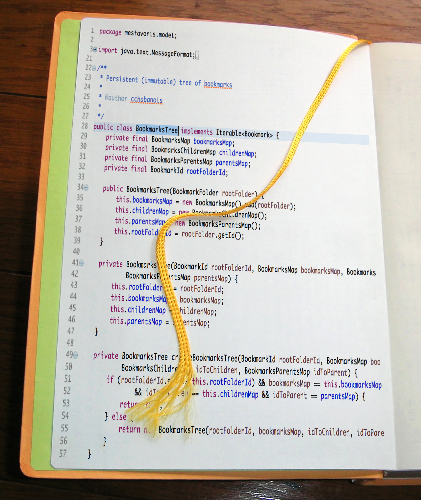

## Table of Contents

- [Features](#features)
- [Installation](#installation)
- [Getting Started](#getting-started)
- [Tool Window](#tool-window)
  - [Toolbar actions](#toolbar-actions)
  - [Bookmark tree](#bookmark-tree)
  - [Details panel](#details-panel)
- [Bookmark Types](#bookmark-types)
  - [File](#file)
  - [URL](#url)
  - [Snippet](#snippet)
  - [Java Member](#java-member)
  - [Note](#note)
  - [Shortcut](#shortcut)
  - [Action](#action)
- [Markers](#markers)
- [Search Everywhere](#search-everywhere)
- [Comments in the editor](#comments-in-the-editor)
- [Keyboard Shortcuts](#keyboard-shortcuts)
- [Local Storage](#local-storage)
- [Path Placeholders](#path-placeholders)
- [Remote Sync (Google Drive)](#remote-sync-google-drive)
  - [Connecting](#connecting)
  - [Sharing a bookmark folder to Google Drive](#sharing-a-bookmark-folder-to-google-drive)
  - [Importing a bookmark folder from Google Drive](#importing-a-bookmark-folder-from-google-drive)
  - [Refreshing](#refreshing)
- [Settings](#settings)
- [License](#license)

---

## Features

- **Hierarchical bookmarks** — organize in folders and subfolders with drag-and-drop
- **Multiple bookmark types** — files, URLs, code snippets, Java members, notes, shortcuts, IDE actions
- **Path placeholders** — portable bookmarks across machines using variables like `${HOME}`
- **Remote sync** — share bookmarks with your team via Google Drive
- **Resilient file bookmarks** — survive refactoring and edits thanks to the Bitap algorithm
- **Search Everywhere** — find any bookmark with double Shift
- **Virtual folders** — automatic Recent, Latest Visited, and Most Visited views
- **Inlay hints** — display bookmark comments inline in the editor
<!-- Plugin description end -->

## Installation

- Using the IDE built-in plugin system:
  
  <kbd>Settings/Preferences</kbd> > <kbd>Plugins</kbd> > <kbd>Marketplace</kbd> > <kbd>Search for "Mes Favoris"</kbd> >
  <kbd>Install</kbd>
  
- Using JetBrains Marketplace:

  Go to [JetBrains Marketplace](https://plugins.jetbrains.com/plugin/29581) and install it by clicking the <kbd>Install to ...</kbd> button in case your IDE is running.

  You can also download the [latest release](https://plugins.jetbrains.com/plugin/29581-mesfavoris/versions) from JetBrains Marketplace and install it manually using
  <kbd>Settings/Preferences</kbd> > <kbd>Plugins</kbd> > <kbd>⚙️</kbd> > <kbd>Install plugin from disk...</kbd>

- Manually:

  Download the [latest release](https://github.com/cchabanois/intellij-mesfavoris/releases/latest) and install it manually using
  <kbd>Settings/Preferences</kbd> > <kbd>Plugins</kbd> > <kbd>⚙️</kbd> > <kbd>Install plugin from disk...</kbd>

---

## Getting Started

### Keyboard shortcuts

Click the gear icon in the tool window and select **Swap Shortcuts with IntelliJ Bookmarks** to use <kbd>F11</kbd> / <kbd>Shift</kbd>+<kbd>F11</kbd> instead of the default <kbd>Alt</kbd>+<kbd>=</kbd> / <kbd>Shift</kbd>+<kbd>Alt</kbd>+<kbd>=</kbd>. No restart required. The rest of this documentation uses the IntelliJ shortcuts.

### Adding your first bookmark

Select the destination folder in the **Mes Favoris** tree, position your cursor on any line in the editor, and press <kbd>F11</kbd>. The bookmark is added immediately to the selected folder. You can also right-click the editor gutter and select **Add Favori**.

To open the **Mes Favoris** tool window, press <kbd>Shift</kbd>+<kbd>F11</kbd>. If your cursor is on a bookmarked line, it will jump directly to that bookmark in the tree.

---

## Tool Window

The tool window has three areas: a **toolbar** at the top, the **bookmark tree** in the middle, and a **details panel** at the bottom.

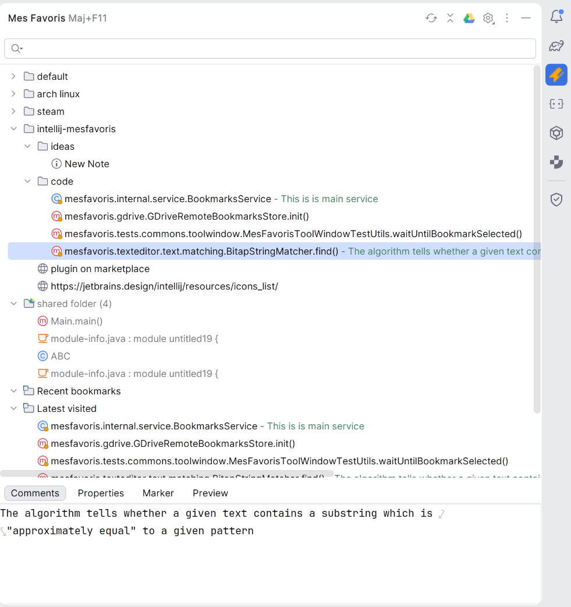

### Toolbar actions

| Icon | Action | Description |
|------|--------|-------------|
| Target | Select Bookmark at Caret | Highlights the bookmark matching the current editor position |
| Drive | Connect to Google Drive | Opens the Google Drive authentication flow to enable remote sync |
| Refresh | Refresh Remote Folders | Pulls latest changes from Google Drive and other remote stores |
| Collapse | Collapse All | Collapses all expanded folder nodes |
| Gear | Settings menu | Access settings, manage placeholders, swap shortcuts, delete credentials |

### Bookmark tree

The tree shows all your bookmarks organized in folders. You can drag and drop bookmarks between folders, and filter the list by typing in the search bar.

Three read-only virtual folders are automatically maintained at the root:

| Folder | Contents |
|--------|----------|
| **Recent** | Bookmarks added most recently |
| **Latest Visited** | Bookmarks navigated to most recently (up to 20) |
| **Most Visited** | Bookmarks navigated to most frequently (up to 20) |

**Context menu** (right-click on a bookmark):

- **Open** / **Open All** — navigate to the bookmark(s)
- **Delete** — remove selected bookmarks (<kbd>Delete</kbd> or <kbd>Backspace</kbd>)
- **Rename** — edit the bookmark name inline
- **New Bookmark Folder** — create a subfolder at the selected location
- **Sort by Name** — sort children alphabetically
- **Copy / Cut / Paste** — move bookmarks between folders (<kbd>Ctrl</kbd>+<kbd>C/X/V</kbd>)
- **Add Shortcut** — create a shortcut bookmark pointing to the selected bookmark
- **Add Note** — create a new Markdown note bookmark
- **Copy/Paste Special > Paste as Snippet** — create a snippet bookmark from the clipboard
- **Open In** — open a URL bookmark in a specific browser (visible on URL bookmarks only)
- **Add to Google Drive** — sync a bookmark folder to Google Drive (visible on folders, requires connection)
- **Remove from Google Drive** — stop syncing a folder, move the Drive file to trash, but keep the folder locally
- **Delete Shared Bookmark Folder** — delete a synced folder locally, with an option to also delete it from Google Drive
- **Import bookmarks...** — import a bookmark folder from Google Drive
- **View in Google Drive** — open the corresponding Drive file in the browser (visible on synced folders)

### Details panel

When you select a bookmark, the details panel shows contextual information across several tabs:

- **Comments** — a free-text field for adding a comment to any bookmark. Comments can also appear as inlay hints in the editor (see [Comments in the editor](#comments-in-the-editor)).
- **Properties** — an editable key/value table showing all internal properties of the bookmark (file path, line number, URL, etc.).
- **Marker** — shown for file bookmarks with an active marker. Displays the file name, line number, and relative path; clicking it opens the file at that line.
- **Preview** — a read-only editor preview of the bookmarked content: the source file around the bookmarked line, the snippet text, or the Java declaration.

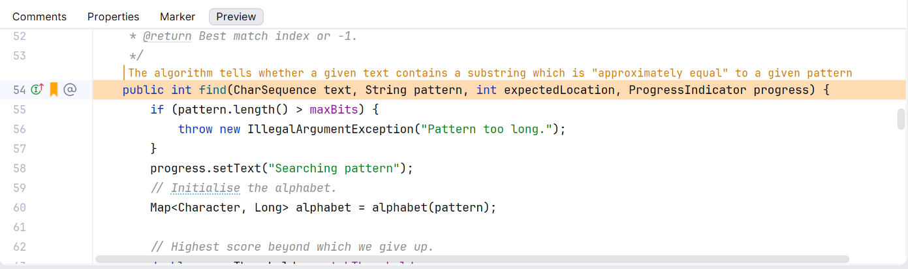

---

## Bookmark Types

You can enable or disable individual bookmark types in **Settings > Tools > Mes Favoris > Bookmark Types**.

### File

A file bookmark points to a specific line in a source file. Select the destination folder in the tree, position your cursor on the target line, and press <kbd>F11</kbd> (or right-click the editor gutter and select **Add Favori**).

The bookmark's position is resilient: even if the file is modified around the bookmarked line, Mes Favoris uses the [Bitap](https://en.wikipedia.org/wiki/Bitap_algorithm) fuzzy-search algorithm to relocate it on the next navigation.

File bookmarks create a **marker** in the editor gutter — a small icon at the bookmarked line. You can click the marker to jump to the bookmark in the tree. If you add a comment to the bookmark, it can also appear as an **inlay hint** above the line in the editor (see [Comments in the editor](#comments-in-the-editor)).

### URL

A URL bookmark stores a web link. To create one, copy the URL to your clipboard, select the destination folder in the tree, then press <kbd>Ctrl</kbd>+<kbd>V</kbd> — Mes Favoris detects the URL in the clipboard, fetches the page title and favicon automatically, and creates the bookmark. Double-clicking it opens the URL in your default browser.

### Snippet

A snippet bookmark stores a code excerpt for quick reference. To create one, copy the code to your clipboard, then right-click in the bookmark tree and choose **Copy/Paste Special > Paste as Snippet**. The snippet is viewable and copyable from the **Preview** tab of the details panel.

### Java Member

A Java member bookmark targets a class, method, or field. Place your cursor inside a Java declaration and press <kbd>F11</kbd> — the plugin automatically captures the class name, member signature, and source file. Navigation jumps directly to the declaration, even if the file has been moved or renamed within the project.

### Note

A note bookmark is a free-form Markdown document. Create one from the tree context menu: right-click a folder and select **Add Note**. The content is editable directly in the **Comments** tab of the details panel.

### Shortcut

A shortcut is a pointer to another bookmark. Select a bookmark in the tree, right-click, and choose **Add Shortcut**. Navigating to the shortcut navigates to the original bookmark. Useful for surfacing the same bookmark in multiple folders.

### Action

An action bookmark wraps an IntelliJ IDE action. To create one, open Search Everywhere (<kbd>Shift</kbd>+<kbd>Shift</kbd>), switch to the **Actions** tab, find the action you want to bookmark, and press <kbd>F11</kbd>. Double-clicking the bookmark in the tree runs the action directly. Useful for keeping frequently used but hard-to-find actions at hand.

---

## Markers

A **marker** is a small icon displayed in the editor gutter at the exact line where a file bookmark points. It gives you a visual reminder that the line is bookmarked without having to open the tool window.

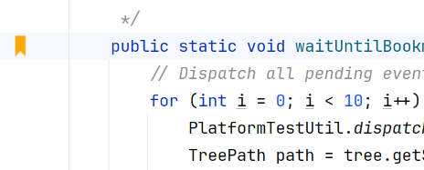

Markers are added automatically when you create a file bookmark. If the bookmarked file is outside the project sources, markers are still shown. You can remove all markers from selected bookmarks via the context menu **Delete Markers**, which removes the gutter indicator without deleting the bookmark itself.

## Search Everywhere

Press <kbd>Shift</kbd>+<kbd>Shift</kbd> to open the Search Everywhere dialog, then switch to the **Mes Favoris** tab to search across all your bookmarks. Selecting a result navigates directly to the bookmark.

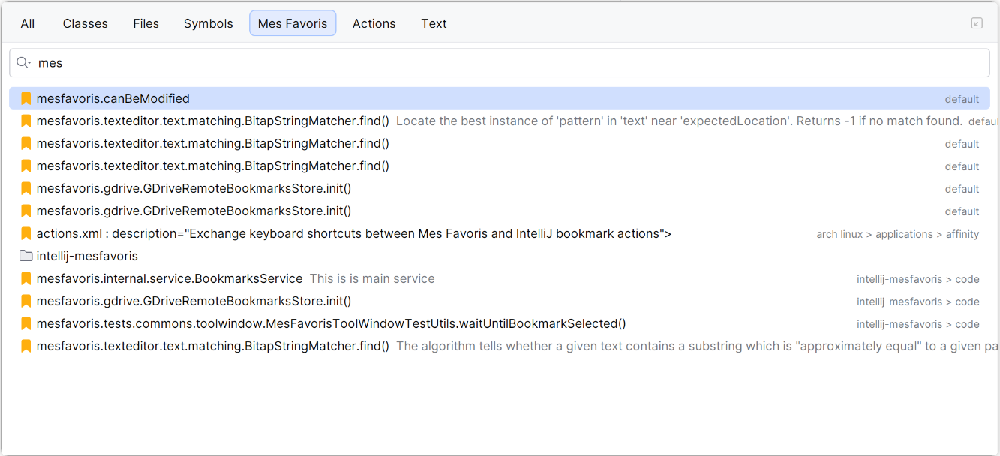

## Comments in the editor

If a bookmark has a comment, it can be displayed as an **inlay hint** directly above the bookmarked line in the editor — without opening the tool window.

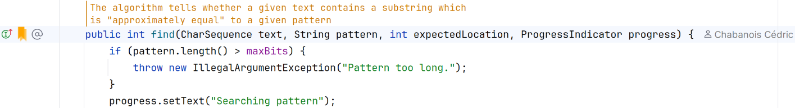

To toggle inlay hints: right-click the editor gutter and select **Show Favori Comments in Editor**. You can also use the gear icon in the tool window > **Show/Hide Bookmark Comment Hints**. The setting takes effect immediately without restarting the IDE.

---

## Keyboard Shortcuts

| Action | IntelliJ shortcuts | Mes Favoris shortcuts |
|--------|-------------------|----------------------|
| Add bookmark | <kbd>F11</kbd> | <kbd>Alt</kbd>+<kbd>=</kbd> |
| Show/go to bookmark | <kbd>Shift</kbd>+<kbd>F11</kbd> | <kbd>Shift</kbd>+<kbd>Alt</kbd>+<kbd>=</kbd> |

Switch between the two schemes via the gear icon > **Swap Shortcuts with IntelliJ Bookmarks** (no restart required). The active shortcut is shown in the tool window title.

---

## Local Storage

Bookmarks are stored per project in `.idea/mesfavoris/bookmarks.json`. You can commit this file to version control to share bookmarks with your team — as an alternative to Google Drive sync.

## Path Placeholders

Path placeholders make bookmarks portable across machines and team members. Instead of storing absolute paths like `/home/alice/projects/myapp/src/Main.java`, Mes Favoris stores `${HOME}/projects/myapp/src/Main.java`.

The `${HOME}` placeholder is predefined and always points to the current user's home directory. You can define additional placeholders — for example `${PROJECTS}` pointing to your projects root.

### Managing placeholders

Go to <kbd>Settings</kbd> > <kbd>Tools</kbd> > <kbd>Mes Favoris</kbd> > <kbd>Placeholders</kbd> (or use the gear icon > **Manage Placeholders**).

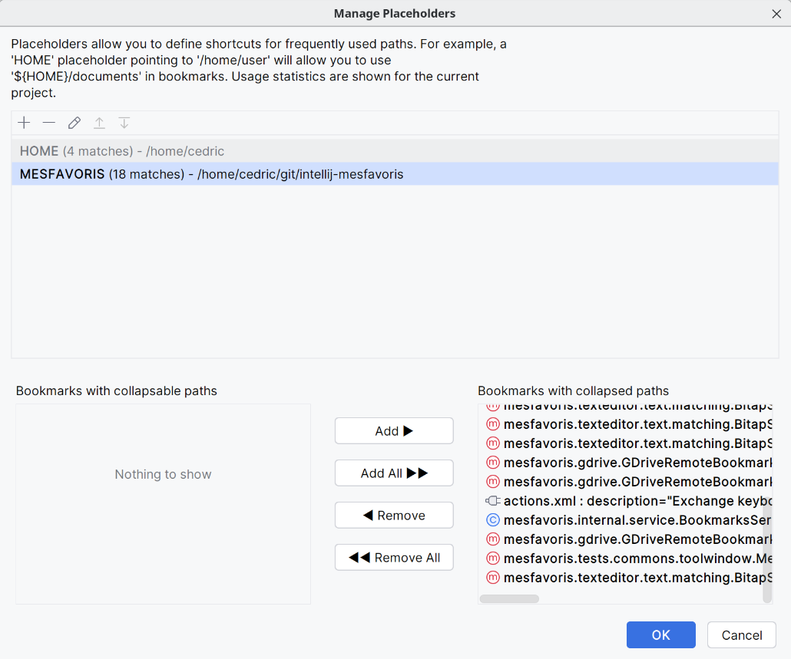

From this panel you can:
- Add, edit, or delete placeholders
- See how many bookmarks use each placeholder
- Bulk-convert bookmarks between absolute paths and placeholder form using the **Collapse** / **Expand** buttons

---

## Remote Sync (Google Drive)

Mes Favoris can sync bookmarks to Google Drive, letting you share them across machines or with your team.

### Connecting

Click the **Connect to Google Drive** icon in the tool window toolbar and authenticate via OAuth 2.0. The plugin only requests the `drive.file` scope — it can only access files it created itself.

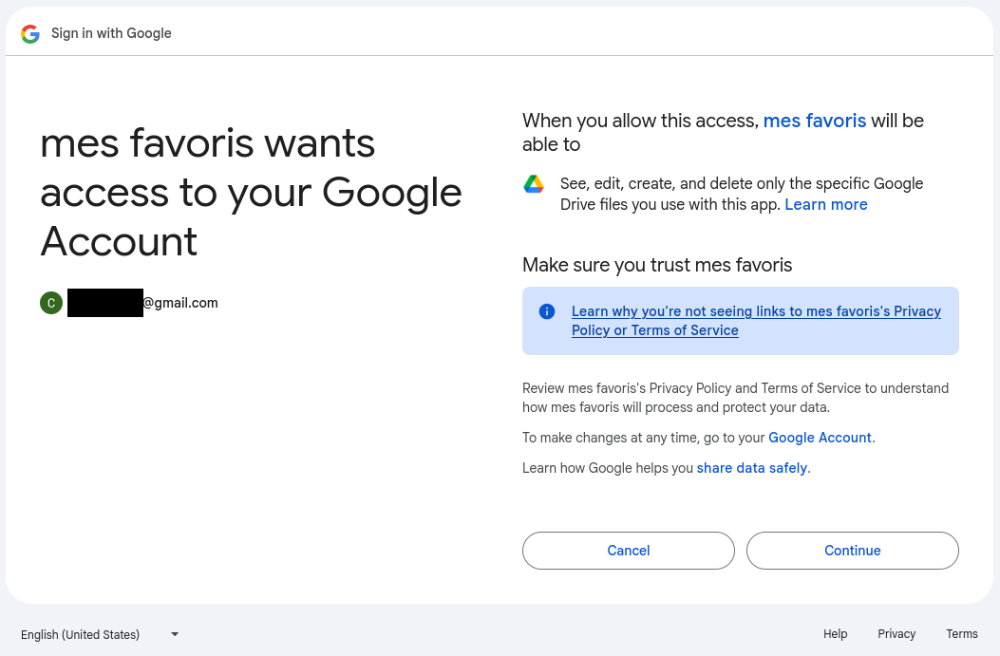

### Sharing a bookmark folder to Google Drive

Right-click any bookmark folder in the tree and select **Add to Google Drive**. The folder and all its contents are uploaded to Google Drive and kept in sync automatically. The folder icon shows a Google Drive overlay to indicate it is remote.

| Connected | Disconnected |
|-----------|--------------|
| 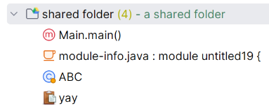 | 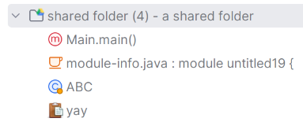 |

When not connected to Google Drive, shared folders are **read-only** — bookmarks inside cannot be added, edited, or deleted.

To stop syncing a folder, right-click it and select **Remove from Google Drive**. The corresponding file is moved to the Google Drive trash, but the folder is kept locally.

### Importing a bookmark folder from Google Drive

Right-click a folder in the tree and select **Import bookmarks...**. A dialog lists all bookmark files previously created by Mes Favoris in your Google Drive. Select one and click **OK** to import it as a new subfolder.

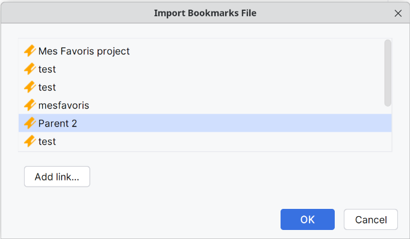

If you want to import a folder shared by someone else, click **Add link...** in the dialog and paste the Google Drive file URL. The file is then listed and can be imported.

### Refreshing

Changes are pulled automatically in the background. To force an immediate refresh, click the **Refresh Remote Folders** button in the toolbar.

To disconnect or remove stored credentials, use the gear icon > **Delete Credentials**.

---

## Settings

<kbd>Settings</kbd> > <kbd>Tools</kbd> > <kbd>Mes Favoris</kbd>

| Page | Scope | Description |
|------|-------|-------------|
| **Placeholders** | IDE-wide | Create and manage path placeholders; view usage statistics |
| **Bookmark Types** | IDE-wide | Enable or disable individual bookmark types |
| **Google Drive** | IDE-wide | Configure OAuth credentials — use the built-in credentials or provide your own Client ID and Client Secret |

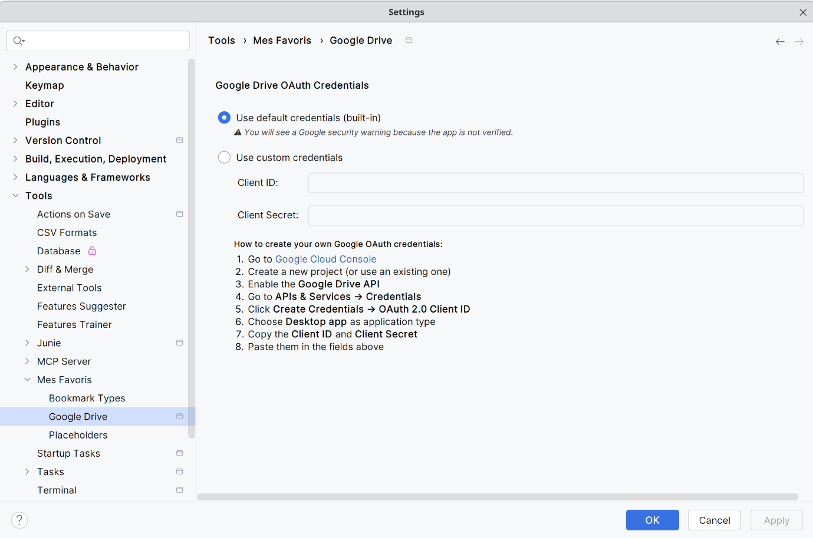

---

## License

Copyright 2024-2026 Cédric Chabanois

Licensed under the Apache License, Version 2.0 (the "License");
you may not use this file except in compliance with the License.
You may obtain a copy of the License at

    http://www.apache.org/licenses/LICENSE-2.0

Unless required by applicable law or agreed to in writing, software
distributed under the License is distributed on an "AS IS" BASIS,
WITHOUT WARRANTIES OR CONDITIONS OF ANY KIND, either express or implied.
See the License for the specific language governing permissions and
limitations under the License.

---
Plugin based on the [IntelliJ Platform Plugin Template][template].

[template]: https://github.com/JetBrains/intellij-platform-plugin-template
[docs:plugin-description]: https://plugins.jetbrains.com/docs/intellij/plugin-user-experience.html#plugin-description-and-presentation
